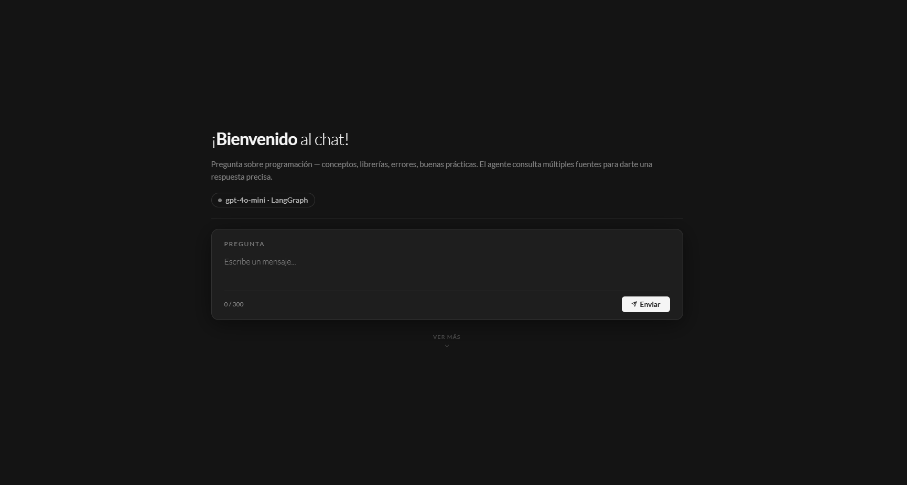
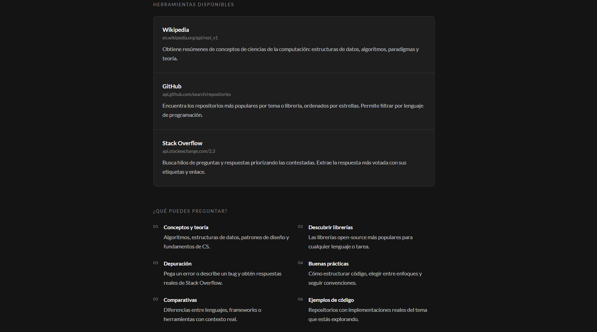

# Research Agent — Investigación y Desarrollo en Programación

Un asistente de IA para investigación y aprendizaje de programación — construido con **LangGraph**, **FastAPI** y **GPT-4o-mini**.

Hacé una pregunta y el agente decide automáticamente si buscar en Wikipedia, GitHub o Stack Overflow para darte una respuesta precisa y con fuentes.

🌐 **[agente-ai-web.vercel.app](https://agente-ai-web.vercel.app/)**

---

> No es un chatbot más.
>
> A diferencia de un chatbot tradicional, este agente no responde desde su memoria — busca, razona y cita fuentes reales en tiempo real. Gracias a Wikipedia, supera el límite de conocimiento de GPT-4o-mini (enero 2024) y puede responder sobre tecnologías y modelos actuales. Una sola consulta: repositorios relevantes, teoría y soluciones reales de la comunidad**.


---


## Funcionalidades

-  **Agente ReAct** — razona paso a paso y elige la herramienta correcta para cada consulta
-  **Wikipedia** — explica conceptos de CS, algoritmos, estructuras de datos y tecnologías actuales más allá del límite de memoria del LLM
-  **GitHub** — encuentra las mejores librerías y proyectos open-source por tema y lenguaje
-  **Stack Overflow** — recupera la mejor pregunta respondida con su respuesta más votada
-  **Interfaz web** — frontend HTML/Jinja2 servido por FastAPI
-  **Rate limiting** — ventana deslizante por IP para prevenir abuso

---

## Stack Tecnológico

| Capa | Tecnología |
|---|---|
| Agente | LangGraph + LangChain |
| LLM | GPT-4o-mini (OpenAI) |
| API | FastAPI + Uvicorn |
| Frontend | Jinja2 Templates |
| Cliente HTTP | httpx |

---

## Capturas





---

## Correr el proyecto de forma local

### 1. Clonar el repositorio

```bash
git clone https://github.com/tu-usuario/tu-repo.git
cd tu-repo
```

### 2. Instalar dependencias

```bash
pip install -r requirements.txt
```

### 3. Configurar variables de entorno

Crear un archivo `.env` en la raíz del proyecto:

```env
OPENAI_API_KEY=tu_openai_api_key
GITHUB_TOKEN=tu_github_token   # Opcional — aumenta el rate limit de la API de GitHub
```

### 4. Iniciar el servidor

```bash
uvicorn main:app --reload
```

Abrí `http://localhost:8000` en tu navegador.

---

## Cómo Funciona

```
Prompt del usuario
    │
    ▼
FastAPI valida la solicitud (longitud + rate limit)
    │
    ▼
Agente ReAct de LangGraph
    ├── search_wikipedia     → Conceptos, teoría de CS y tecnologías post-2024
    ├── search_github        → Librerías y proyectos open-source
    └── search_stackoverflow → Errores, how-tos y buenas prácticas
    │
    ▼
Respuesta en markdown con fuentes
```

---

## Configuración

| Variable | Valor por defecto | Descripción |
|---|---|---|
| `MAX_PROMPT_LENGTH` | 300 | Máximo de caracteres por prompt |
| `MAX_REQUESTS_PER_MINUTE` | 3 | Rate limit por IP (ventana de 2 minutos) |
| `recursion_limit` | 10 | Máximo de pasos ReAct por consulta |
| `max_tokens` | 500 | Máximo de tokens en la respuesta del agente |

---

## Dependencias

```
fastapi
uvicorn
jinja2
langchain
langchain-openai
langgraph
python-dotenv
```
